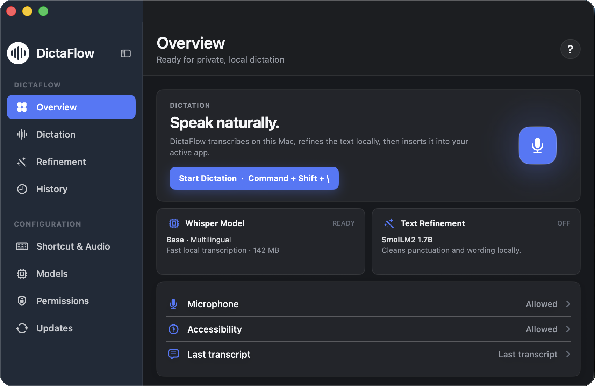
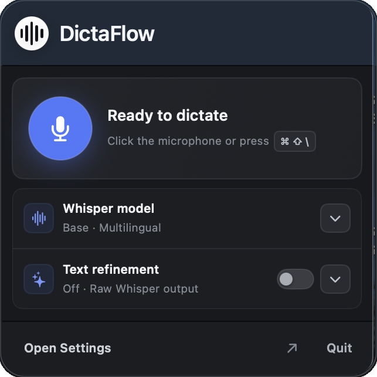

<p align="center">
  
</p>

<p align="center">
  <strong>Private dictation that types where you work.</strong><br>
  Speak naturally. DictaFlow turns your voice into polished text on your Mac.
</p>

<p align="center">
  <a href="https://github.com/rmscoal/dictaflow/releases/latest"></a>
  
  
  
  <a href="LICENSE"></a>
</p>

<p align="center">
  <a href="https://github.com/rmscoal/dictaflow/releases/latest"><strong>Download DictaFlow</strong></a>
</p>

## DictaFlow Showcase

<p align="center">
  <br>
  <sub>The main app keeps dictation, local models, and permissions in one place.</sub>
</p>

<table align="center">
  <tr>
    <td align="center" valign="middle">
      <br>
      <sub>Start dictation and change essential options from the menu bar.</sub>
    </td>
    <td align="center" valign="middle">
      <br>
      <sub>A small recording indicator stays out of your way.</sub>
    </td>
  </tr>
</table>

## Table of contents

- [DictaFlow Showcase](#dictaflow-showcase)
- [Introduction](#introduction)
- [Requirements](#requirements)
- [Installation](#installation)
- [Inside DictaFlow](#inside-dictaflow)
- [Models and Local Data](#models-and-local-data)
- [Updates](#updates)
- [Troubleshooting](#troubleshooting)
- [Development](#development)
- [License](#license)

## Introduction

DictaFlow is a native macOS app for people who think faster than they type. It
records your voice, transcribes or translates it with `whisper.cpp`, and puts
the result into the app you were using.

Everything runs locally. There is no cloud transcription, account, analytics,
or API key.

| | |
| --- | --- |
| **Stay private** | Audio, transcription, and optional text refinement remain on your Mac. |
| **Keep your flow** | Start dictation with a global shortcut and continue in the same app. |
| **Speak your language** | Transcribe in many languages or translate supported speech into English. |
| **Clean up locally** | An optional local language model can improve punctuation and wording before insertion. |
| **Reuse the result** | Review, copy, or insert your latest transcript again. |

## Requirements

| | Requirement |
| --- | --- |
| **Mac** | Apple silicon |
| **macOS** | 13.0 or newer |
| **Internet** | Needed to download the app, models, and updates |

After the models are downloaded, dictation works offline.

## Installation

1. Download the DMG from the [latest release](https://github.com/rmscoal/dictaflow/releases/latest).
2. Open it and drag **DictaFlow** into **Applications**.
3. Launch DictaFlow and follow the permission prompts when needed.

Public releases are signed and notarized for macOS.

## Inside DictaFlow

| Step | What happens |
| --- | --- |
| **Record** | DictaFlow creates a temporary local `.m4a` recording. |
| **Transcribe** | `whisper.cpp` converts speech to text on your Mac. |
| **Refine** | If enabled, a local language model cleans the text. |
| **Insert** | DictaFlow returns the text to the previously focused app. |

Insertion uses the best available method: direct Accessibility insertion,
clipboard paste, simulated typing, then a copy panel as the final fallback.

### Transcribe or translate

- **Transcribe** keeps the spoken language.
- **Translate** converts supported source languages into English.

### Optional refinement

Local refinement can fix punctuation, repeated wording, and rough sentence
structure. It is optional. If refinement fails, DictaFlow uses the original
Whisper transcript.

## Models and Local Data

Models are downloaded when you prepare them in DictaFlow. Every download is
checksum-verified before use.

| Model type | Available sizes |
| --- | --- |
| Whisper | Tiny 75 MB, Base 142 MB, Small 466 MB, Medium 1.5 GB |
| Refinement | Qwen2.5 0.5B, Qwen2.5 1.5B, Qwen2.5 3B, SmolLM2 1.7B |

Models are stored in:

```text
~/Library/Application Support/DictaFlow/Models
```

Open **Models** to view, prepare, or remove models.

| Data | Storage behavior |
| --- | --- |
| Recordings | Temporary files, deleted after processing |
| Latest transcript | Kept in memory for review, copy, and re-insertion |
| Models | Stored locally until you remove them |
| Clipboard | Used briefly when needed, with restoration attempted |

## Updates

DictaFlow checks GitHub Releases for updates. When a new version is available:

1. Open **Updates**.
2. Open the release page and download the new DMG.
3. Replace the old DictaFlow app in **Applications**.

Automatic checks can be turned off. DictaFlow sends no transcript, model, or
usage data during an update check.

## Troubleshooting

| Problem | Try this |
| --- | --- |
| Dictation does not start | Open **Permissions** and allow microphone access. |
| Text is not inserted | Allow Accessibility access, then try again. The copy panel remains available as a fallback. |
| First dictation is slow | Wait for the selected model to finish downloading and preparing. |
| Accuracy is too low | Select a larger Whisper model or set the input language instead of automatic detection. |
| Disk use is too high | Open **Models** and remove models you no longer use. |
| No update appears | Open **Updates** or check the [latest release](https://github.com/rmscoal/dictaflow/releases/latest). |

## Development

You need Xcode with the macOS SwiftUI and AppKit tooling. Clone the repository,
then run:

```sh
make run
```

Useful commands:

| Command | Purpose |
| --- | --- |
| `make run` | Build, install, and launch DictaFlow Dev |
| `make build` | Build and install without launching |
| `make package-dev` | Create a local development DMG |
| `make verify` | Build, install, verify signing, and launch |

The main Xcode scheme is `DictaFlow Dev`. There is currently no test target, so
changes to permissions, hotkeys, insertion, model storage, or launch behavior
must also be checked with the installed app in `/Applications`.

Contributions are welcome. Please keep DictaFlow local-first and read
[CONTRIBUTING.md](CONTRIBUTING.md) before submitting a change.

## License

DictaFlow is licensed under the [GNU Affero General Public License v3.0 or later](LICENSE).
Third-party notices are listed in [THIRD_PARTY_NOTICES.md](THIRD_PARTY_NOTICES.md)
and [NOTICE](NOTICE).
