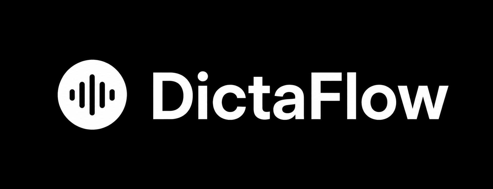

<p align="center">
  
</p>

<p align="center">Turn speech into polished text, locally.</p>
<p align="center">
  <span style="display:inline-block;padding:0.35rem 0.8rem;border-radius:999px;background:#111827;color:#f8fafc;font-size:0.82rem;font-weight:700;letter-spacing:0.04em;text-transform:uppercase;">
    For Apple Silicon Macs
  </span>
</p>

DictaFlow was built for the moment when typing slows you down. It turns
speech into text on your Mac, optionally cleans it up with a local LLM, and
puts the result back where you were already working.

It is for people who think better out loud, write faster when they can speak
naturally, and want to use the CPU and GPU already built into their Mac
instead of sending audio anywhere else.

## Why Local

DictaFlow runs locally because the hardware is already there. If you have a
MacBook Pro with Apple silicon, you already have fast CPU and GPU resources
right next to your keyboard. DictaFlow uses that power for private
speech-to-text and local refinement instead of turning the workflow into a
cloud round trip.

## What It Does

- Local transcription through `whisper.cpp`.
- Optional transcript refinement with an editable local prompt.
- Insertion back into the focused app with Accessibility, clipboard, typing,
  or a copy panel fallback.

## Privacy Model

DictaFlow is local-first:

- Microphone audio is recorded locally.
- Whisper transcription runs locally.
- Optional refinement runs locally through `llama-server`.
- There is no cloud transcription path, analytics pipeline, or remote
  inference service in the app code.

| Data | Behavior |
| --- | --- |
| Recordings | Temporary local `.m4a` files under `FileManager.default.temporaryDirectory/DictaFlowRecordings`, deleted after transcription finishes or fails. |
| Transcripts | Kept in memory as the latest transcript for display, copy, and re-insertion. |
| Models | Stored under `~/Library/Application Support/DictaFlow/Models`. |
| Clipboard | May be used briefly for paste-based insertion, with an attempt to restore the previous contents. |
| Logs | Whisper logs audio stats and transcript length, not transcript contents. |
| Update checks | The production app checks the public GitHub Releases API at most once per day when automatic checks are enabled. GitHub receives normal connection metadata such as the user’s IP address. DictaFlow sends no account, transcript, model, or usage data. |

## Requirements

- macOS 13.0 or newer.
- Xcode with macOS SwiftUI/AppKit tooling.
- Microphone permission for recording.
- Accessibility permission for automatic insertion into other apps.
- Network access for first-time model downloads.
- Network access for optional GitHub release checks.
- `llama-server` bundled in public builds for local transcript refinement.

## Updates

DictaFlow checks only published, non-prerelease GitHub Releases. Release tags
must use numeric versions such as `v1.0.1`, and the release must include a
non-empty `.dmg` asset. When a newer version is available, DictaFlow shows an
update button that opens the release page in the user’s browser. Downloading
and installing the signed, notarized DMG remains a manual step. Automatic
checks are enabled by default in the production app, can be disabled in
Settings, and are disabled by default in DictaFlow Dev.

## Build and Run Locally

Clone the repo, then use the Make targets:

```sh
make run            # build, install to /Applications, and launch DictaFlow Dev
make package-dev    # build DictaFlow Dev and create .build/DictaFlow.dmg
```

`make run` is the fastest loop to get started.

If you want the explicit install path:

1. Run `make install-dev`.
2. Open `DictaFlow Dev` from `/Applications`.
3. Approve Microphone access when prompted.
4. Approve Accessibility access when DictaFlow needs to insert text into
   another app.

## Testing

There is currently no dedicated test target.

For changes that touch permissions, hotkeys, text insertion, clipboard
restoration, model downloads, or app launch, verify manually with an installed
app from `/Applications`.

## Contributing

Contributions are welcome. Please keep DictaFlow local-first and avoid adding
cloud inference, analytics, telemetry, or remote transcription paths.

See [CONTRIBUTING.md](CONTRIBUTING.md) for contribution licensing terms.

## License

DictaFlow is licensed under the GNU Affero General Public License, version 3 or
later. See [LICENSE](LICENSE).

Third-party notices are tracked in [THIRD_PARTY_NOTICES.md](THIRD_PARTY_NOTICES.md)
and [NOTICE](NOTICE).
