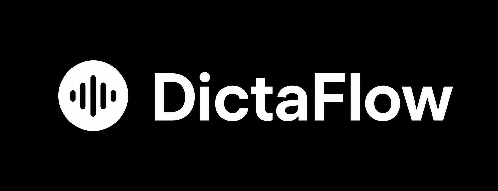
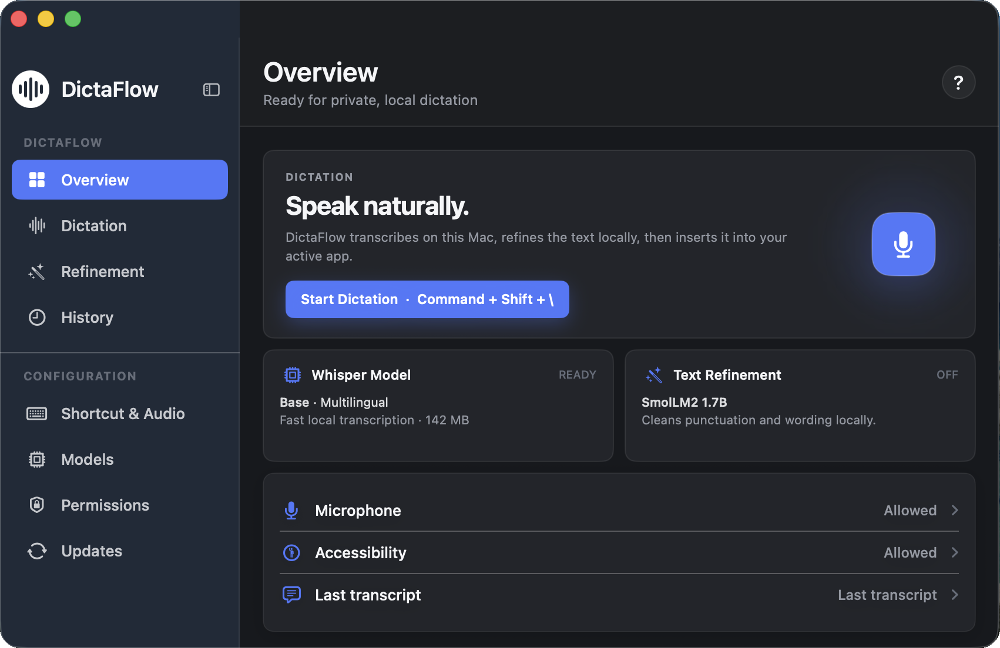
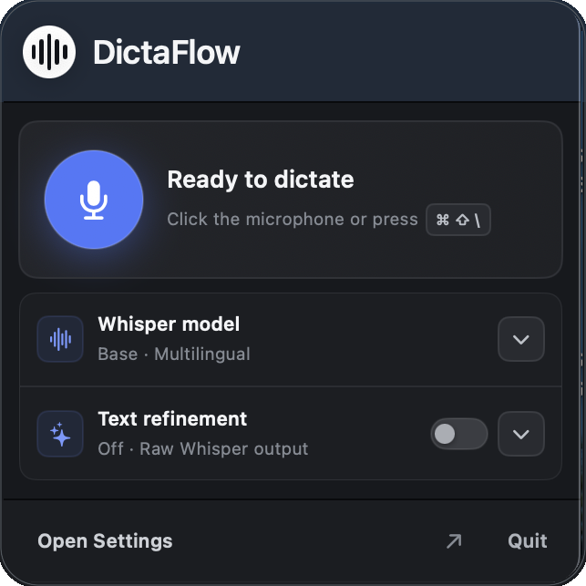

<p align="center">
  
</p>

<p align="center">
  <strong>Private dictation that types where you work.</strong><br>
  Speak naturally. DictaFlow turns your voice into polished text on your Mac.
</p>

<p align="center">
  <a href="https://github.com/rmscoal/dictaflow/releases/latest"></a>
  
  
  
  <a href="LICENSE"></a>
</p>

<p align="center">
  <a href="https://github.com/rmscoal/dictaflow/releases/latest"><strong>Download DictaFlow</strong></a>
</p>

## DictaFlow Showcase

<p align="center">
  <br>
  <sub>The main app keeps dictation, local models, and permissions in one place.</sub>
</p>

<table align="center">
  <tr>
    <td align="center" valign="middle">
      <br>
      <sub>Start dictation and change essential options from the menu bar.</sub>
    </td>
    <td align="center" valign="middle">
      <br>
      <sub>A small recording indicator stays out of your way.</sub>
    </td>
  </tr>
</table>

## Table of contents

- [DictaFlow Showcase](#dictaflow-showcase)
- [Introduction](#introduction)
- [Requirements](#requirements)
- [Installation](#installation)
- [Inside DictaFlow](#inside-dictaflow)
- [Models and Local Data](#models-and-local-data)
- [Updates](#updates)
- [Troubleshooting](#troubleshooting)
- [Development](#development)
- [License](#license)

## Introduction

DictaFlow is a native macOS app for people who think faster than they type. It
records your voice, transcribes or translates it with `whisper.cpp`, and puts
the result into the app you were using.

Everything runs locally. There is no cloud transcription, account, analytics,
or API key.

| | |
| --- | --- |
| **Stay private** | Audio, transcription, and optional text refinement remain on your Mac. |
| **Keep your flow** | Start dictation with a global shortcut and continue in the same app. |
| **Speak your language** | Transcribe in many languages or translate supported speech into English. |
| **Clean up locally** | An optional local language model can improve punctuation and wording before insertion. |
| **Reuse the result** | Review, copy, or insert your latest transcript again. |

## Requirements

| | Requirement |
| --- | --- |
| **Mac** | Apple silicon |
| **macOS** | 14.0 or newer |
| **Internet** | Needed to download the app, models, and updates |

After the models are downloaded, dictation works offline.

## Installation

1. Download the DMG from the [latest release](https://github.com/rmscoal/dictaflow/releases/latest).
2. Open it and drag **DictaFlow** into **Applications**.
3. Launch DictaFlow and follow the permission prompts when needed.

Public releases are signed and notarized for macOS.

## Inside DictaFlow

| Step | What happens |
| --- | --- |
| **Record** | DictaFlow creates a temporary local `.m4a` recording. |
| **Transcribe** | Bundled speech detection filters non-speech audio before `whisper.cpp` converts speech to text on your Mac. |
| **Refine** | If enabled, a local language model cleans the text. |
| **Insert** | DictaFlow returns the text to the previously focused app. |

Insertion uses the best available method: direct Accessibility insertion,
clipboard paste, simulated typing, then a copy panel as the final fallback.

### Transcribe or translate

- **Transcribe** keeps the spoken language.
- **Translate** converts supported source languages into English.

### Optional refinement

Local refinement can fix punctuation, repeated wording, and rough sentence
structure. It is optional. If refinement fails, DictaFlow uses the original
Whisper transcript.

The Refinement page offers local models from Qwen, Meta Llama, Google Gemma, and
Microsoft Phi. Download a model, then choose **Use model**. Downloading never
changes the active model. Each row shows file size, estimated model RAM,
progress, and cancellation. RAM estimates exclude Whisper and other apps.
Existing Qwen3 0.6B selections stay unchanged while the newer models are evaluated.
Models load when recording starts, remain ready between dictations, and sleep
after five minutes without use.

Refinement uses the bundled llama-server engine. Older model preferences migrate
to standard Qwen3, and old downloads remain available for removal from Storage.
Until the selected model is downloaded, dictation uses the original transcript.

## Models and Local Data

Models are downloaded when you prepare them in DictaFlow. Every download is
checksum-verified before use.

| Model type | Available sizes |
| --- | --- |
| Whisper | Tiny 75 MB, Base 142 MB, Small 466 MB, Medium 1.5 GB |
| Refinement | Qwen3 0.6B: 397 MB; new models: approximately 1.28–3.35 GB |

Models are stored in:

```text
~/Library/Application Support/DictaFlow/Models
```

Open **Models** to view, prepare, or remove models.

| Data | Storage behavior |
| --- | --- |
| Recordings | Temporary files, deleted after processing |
| Latest transcript | Kept in memory for review, copy, and re-insertion |
| Models | Stored locally until you remove them |
| Clipboard | Used briefly when needed, with restoration attempted |

## Updates

DictaFlow checks GitHub Releases for updates. When a new version is available:

1. Open **Updates**.
2. Open the release page and download the new DMG.
3. Replace the old DictaFlow app in **Applications**.

Automatic checks can be turned off. DictaFlow sends no transcript, model, or
usage data during an update check.

## Troubleshooting

| Problem | Try this |
| --- | --- |
| Dictation does not start | Open **Permissions** and allow microphone access. |
| Text is not inserted | Allow Accessibility access, then try again. The copy panel remains available as a fallback. |
| First dictation is slow | Wait for the selected model to finish downloading and preparing. |
| Accuracy is too low | Select a larger Whisper model or set the input language instead of automatic detection. |
| Disk use is too high | Open **Models** and remove models you no longer use. |
| No update appears | Open **Updates** or check the [latest release](https://github.com/rmscoal/dictaflow/releases/latest). |

## Development

You need Xcode with the macOS SwiftUI and AppKit tooling. Clone the repository,
then run:

```sh
make run
```

Useful commands:

| Command | Purpose |
| --- | --- |
| `make run` | Build, install, and launch DictaFlow Dev |
| `make build` | Build and install without launching |
| `make package-dev` | Create a local development DMG |
| `make uninstall-dev` | Remove only DictaFlow Dev from `/Applications` |
| `make reset-dev` | Reset Dev onboarding, Microphone, and Accessibility permissions |
| `make verify` | Build, install, verify signing, and launch |

The main Xcode scheme is `DictaFlow Dev`. `DictaFlowTests` covers refinement
lifecycle and optional real-model inference. See [the verification guide](Tests/README.md). Changes to permissions, hotkeys, insertion, model storage, or launch behavior
must also be checked with the installed app in `/Applications`.

Contributions are welcome. Please keep DictaFlow local-first and read
[CONTRIBUTING.md](CONTRIBUTING.md) before submitting a change.

## License

DictaFlow is licensed under the [GNU Affero General Public License v3.0 or later](LICENSE).
Third-party notices are listed in [THIRD_PARTY_NOTICES.md](THIRD_PARTY_NOTICES.md)
and [NOTICE](NOTICE).


## Writing style and local prompts

Choose Normal Cleanup, Professional Formal, Casual Text Messaging, Technical and
Engineering, or DIY. The first four have optional **Additional instructions**
saved separately for each mode and a static writing example. DIY replaces the
built-in prompt with your own system prompt. Write Markdown source and switch
to Preview to check headings, bullets, emphasis, and code. Preview never changes
the saved source. Click Save before your edits affect dictation.

Built-in prompts ship in `Resources/RefinementPrompts`. Selected model, mode,
and refinement enablement use the existing local preferences. DIY Markdown is
stored as `Prompts/refinement.txt`; preset additions use `Prompts/preset-instructions.json`
under the app's Application Support directory. Dev uses `DictaFlow Dev`, and
release uses `DictaFlow`. Old Dev prompts are copied once from the previously
shared folder, and an existing custom prompt migrates to DIY. Files are private
and written atomically. Saving preset additions reloads the existing file first;
unreadable instructions are kept intact until the file is repaired and Save is
retried. History stores the effective prompt snapshot for each
attempt in its existing SQLite database. Clearing history leaves prompts intact.

Long transcripts are split at paragraph or sentence boundaries using the loaded
model's tokenizer and context budget. Chunks run in order. An editable ending is carried into the next rewrite so
nearby self-corrections can cross source boundaries. Recent earlier output supplies
read-only context for style and list numbering and is not appended again. An
incomplete or failed chunk rejects the whole rewrite and uses
the original transcription. Large DIY prompts may need shortening. Chunked
rewrites still cannot resolve corrections referring far back beyond the retained
context; model accuracy and formatting should be evaluated on real recordings.
Qwen3 0.6B has also omitted a corrected date in a synthetic long technical passage,
even with boundary context. Context support does not guarantee factual preservation.

Meta's model section displays “Built with Llama”; its license and notice ship
in `Resources/ThirdParty`. All inference stays on-device through llama.cpp.
